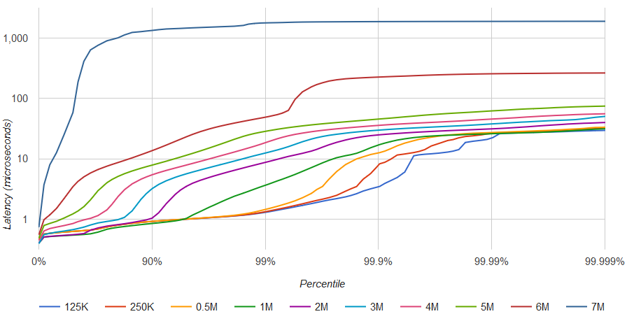

# exchange-core

[![][license img]][license]

**Ultra-fast market exchange core matching engine** based on LMAX Disruptor and Eclipse Collections (ex. Goldman Sachs GS Collections).

Capable to process 5M order book operations per second on 8-years old hardware (Intel® Xeon® X5690) with moderate latency degradation:

|rate|50.0%|90.0%|95.0%|99.0%|99.9%|99.99%|worst|
|----|-----|-----|-----|-----|-----|------|-----|
|125K|0.6µs|0.9µs|1.0µs|1.4µs|4µs  |24µs  |41µs |
|250K|0.6µs|0.9µs|1.0µs|1.4µs|9µs  |27µs  |41µs |
|500K|0.6µs|0.9µs|1.0µs|1.6µs|14µs |29µs  |42µs |
|  1M|0.5µs|0.9µs|1.2µs|4µs  |22µs |31µs  |45µs |
|  2M|0.5µs|1.2µs|3.9µs|10µs |30µs |39µs  |60µs |
|  3M|0.7µs|3.6µs|6.2µs|15µs |36µs |45µs  |60µs |
|  4M|1.0µs|6.0µs|9µs  |25µs |45µs |55µs  |70µs |
|  5M|1.5µs|9.5µs|16µs |42µs |150µs|170µs |190µs|
|  6M|5µs  |30µs |45µs |300µs|500µs|520µs |540µs|
|  7M|60µs |1.3ms|1.5ms|1.8ms|1.9ms|1.9ms |1.9ms|

Benchmark configuration:
- Single symbol order book.
- 3,000,000 inbound messages are distributed as follows: 9% limit + 3% market new orders, 6% cancel operations, 82% move operations. About 6% commands are causing trades.
- 1,000 active user accounts.
- In average ~1,000 limit orders are active, placed in ~750 different price slots.
- Latency results are only for risk processing and orders matching. Other stuff like network interface latency, IPC, journalling is not included.
- Test data is not bursty, meaning constant interval between commands (0.2~8µs depending on target throughput).
- BBO prices are not changing significantly throughout the test. No avalanche orders.
- No coordinated omission effect for latency benchmark. Any processing delay affects measurements for next following messages.
- GC is triggered prior/after running every benchmark cycle (3,000,000 messages).
- RHEL 7.5, network-latency tuned profile, dual X5690 6 cores 3.47GHz, one socket isolated and tickless, spectre/meltdown protection disabled.

### Main features
- HFT optimized. Priority is a limit-order-move operation mean latency (currently ~0.5µs). Cancel operation takes ~0.7µs, placing new order ~1.0µs;
- In-memory working state.
- Lock-free and contention-free orders matching and risk control algorithms.
- No floating-point operations, no accuracy loss.
- Matching engine and risk control operations are atomic and deterministic.
- Pipelined multi-core processing (based on LMAX Disruptor): each CPU core is responsible for certain processing stage, user accounts shard, or symbol order books shard.
- Low GC pressure, objects pooling.
- Two different risk processing modes (per symbol): direct-exchange and margin-trade.
- Supports crossing Ask-Bid orders for market makers.
- Two implementations of matching engine: reference (naive) and performance-optimized.
- Testing - unit-tests, integration tests, stress tests, integrity tests.
- Automatic threads affinity (requires JNA).

### TODOs
- Journalling support, event-sourcing - snapshot and replay operations support.
- Market data feeds (full order log, L2 market data, BBO, trades).
- Clearing and settlement.
- FIX and REST API gateways.
- More tests and benchmarks.
- NUMA-aware.

### How to run tests
- Latency test: mvn -Dtest=PerfLatency#latencyTest test
- Throughput test: mvn -Dtest=PerfThroughput#throughputTest test
- Hiccups test: mvn -Dtest=PerfHiccups#hiccupsTest test

[license]:LICENSE.txt
[license img]:https://img.shields.io/badge/License-Apache%202-blue.svg
